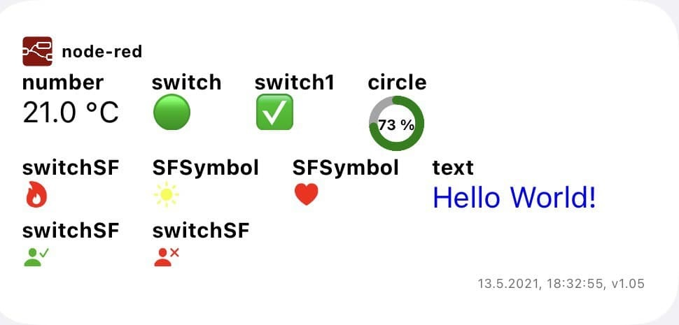
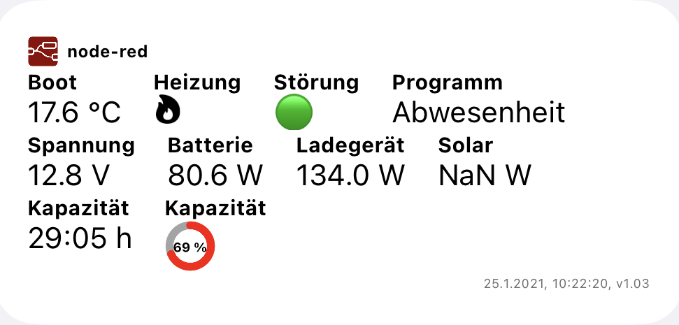
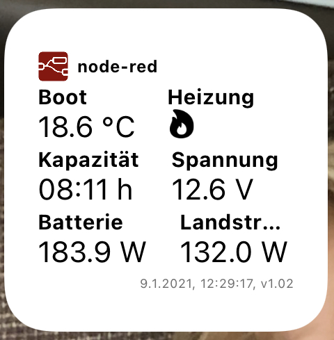
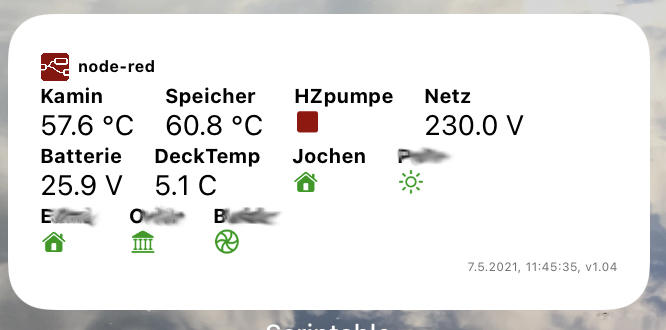

# node-red-scriptable
2021 by Ranki <s.rankers@einfach-beraten.de>

Permission to use, copy, modify, and/or distribute this software for any purpose with or without fee is hereby granted.

THE SOFTWARE IS PROVIDED "AS IS" AND THE AUTHOR DISCLAIMS ALL WARRANTIES WITH REGARD TO THIS SOFTWARE INCLUDING ALL
IMPLIED WARRANTIES OF MERCHANTABILITY AND FITNESS. IN NO EVENT SHALL THE AUTHOR BE LIABLE FOR ANY SPECIAL, DIRECT,
INDIRECT, OR CONSEQUENTIAL DAMAGES OR ANY DAMAGES WHATSOEVER RESULTING FROM LOSS OF USE, DATA OR PROFITS, WHETHER
IN AN ACTION OF CONTRACT, NEGLIGENCE OR OTHER TORTIOUS ACTION, ARISING OUT OF OR IN CONNECTION WITH THE USE OR PERFORMANCE
OF THIS SOFTWARE.

*DESCRIPTION*

This scriptable shows data from node-red resp. an external JSON-string.
See further details (example of JSON-file and node-red integration) at the end of the coding!

The scriptable can be used in small or medium mode (see examples). The alignment will be automatically done by the script. 

*FEATURES*

The script can process several types of data like text, numbers (will be rounded), switches (with different possibilities like SFSymbols) and circles (e.g. to show a level indicator).

*EXAMPLES*

<table align="center">
 <tr>
  <td colspan=2>
  
  </td>
 </tr>
  <tr>
   <td colspan=2>
  Medium size widget, «Hello world» example, v1.05
  </td>
 </tr>
 <tr>
   <td width=70%>
  
  </td>
  <td width=30%>
  
  </td>
 </tr>
  <tr>
   <td width=70%>
  Medium size Widget, user example: Ranki, v1.03
  </td>
  <td width=30%>
  Small size Widget, user example: Ranki, v1.02
  </td>
 </tr>
 <tr>
   <td width=70%>
  
  </td>
  <td width=30%>
  &nbsp;
  </td>
 </tr>
  <tr>
   <td width=70%>
  Medium size Widget, user example: Jochen, v1.04
  </td>
  <td width=30%>
  &nbsp;
  </td>
 </tr>
</table>

*INSTALLATION*

1. Implement the node-red-integration.json part into your node-red installation and adapt the created functions to fill the requested JSON. The current implementation expects the file to be written directly to the node-red instance file system. Alternatively you can also create the file and upload it via FTP to a server of your choice.
2. Implement the node-red.js into your scriptable app and adapt the variables in the beginning (host, subfolder, filename, opt. authentication etc.)

Enjoy!

*RELEASE NOTES*
Version 1.05 (13.05.2021)
 - typos corrected
 - introduced general possibility to transfer color information in data.color
 - changed structure in SFSymbol from data.SFSymbol_Color to data.color  (but downside compatible)
 - enabled possibility to determ color of circle filling
 - switch to use dark mode added
 - code resturctured a little bit in order to have all settings at the top
 - optimized node-red example

Version 1.04 (2021-05-04)
 - typos corrected
 - Added general colour support for SFSymbols with function tintSFSymbol(image, color)
 - Added new type 'SFSymbol' (see example below)
 - Added color support for type switchSF (see example below)
 - Function to invert colors in darkmode (ggf. https://stackoverflow.com/questions/35969656/how-can-i-generate-the-opposite-color-according-to-current-color)
 - changed color definition to Hexadecimal-values only (w/o new Color())
 - Added cached data, if request fails
 - Reworked node-red integration and widget-file example (see below)

Version 1.03 (2021-01-10)
 - minimal bugfixing
 - implementation of dataype 'circle'
 - change default for basic auhentication to 'false'

Version 1.02 (2021-01-09)
 - minimal bugfixing
 - manual dark mode does influence widget background color, but does not provide variable dark
 - enhaced error handling:
 		- missing widget in JSON
      - specify function in catch-error and write2error
      - add critical error indicator in order to write errors w/o error msg to the user

Version 1.01 (2021-01-08)
- enhanced color support of dark mode
- seperated header and footer creation
- separate logging and errors into separate functions
- enhanced error handling

Version 1.0 (2021-01-06)
- initial creation

*BACKLOG/ IDEAS*

 - enable differentiated text colors
 - definition of text colors for different ranges of the data value (example: 0-25: green, 26-50: yellow; 51-75: orange, 76 - 100: red) 

*EXPECTED JSON-file (Example)*

see file: scriptable.ioswidget

*NODE-RED INTEGRATION (Example)*

see file: node-red-integration.json

